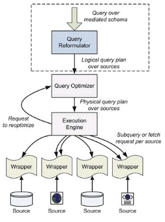

# Unit 3

## describing data sources:
In order for a data integration system to process a query over a set of data sources, the system must know: 
  - which sources are available, 
  - what data exist in each source, and 
  - how each source can be accessed. 

The source descriptions in a data integration system encode this information. 

key topics:
  - different components of source descriptions 
  - identify the trade-offs involved in designing formalisms for source descriptions.
  - 
    - A user (or an application) poses a query to the data integration system using the relations and attributes of the mediated schema. 
    - The system then reformulates the query into a query over the data sources.
    - The result of the reformulation is called a logical query plan. 
    - The logical query plan is later optimized so it runs efficiently.
  - In this chapter we show how source descriptions are expressed and how the system uses them to reformulate the user’s query into a logical query plan.

### Overview and Desiderata: Source Descriptions in Data Integration

Data sources play pivotal role in the realm of data integration, a process that involves combining data from disparate sources to provide a unified view.

#### **Data Sources:**

In the context of data integration, a data source refers to any system or repository that holds information which is potentially valuable for analysis, decision-making, or other business processes. These sources can be diverse, ranging from relational databases and spreadsheets to web services and APIs. Each data source typically has its schema, representing the organization and structure of the data within it. Examples of data sources include transactional databases, legacy systems, cloud-based storage, and external APIs providing real-time data.

**Key Characteristics of Data Sources:**

1. **Structural Variability:**
   - Data sources may have different structures, formats, and terminologies. For instance, a database in one system may use different column names or data types compared to another.

2. **Semantic Differences:**
   - Even when dealing with similar concepts, data sources may represent them differently. This semantic heterogeneity could manifest in variations in naming conventions, units of measurement, or data granularity.

3. **Data Quality Variances:**
   - Data quality can vary between sources due to factors such as accuracy, completeness, and consistency. Some sources may have clean, well-maintained data, while others may suffer from errors or missing information.

4. **Access Patterns:**
   - Different data sources support varying access patterns. While some may allow complex queries, others may have restrictions, limiting the types of queries that can be performed.

#### **Desiderata:**

The term "desiderata" refers to the requirements or goals that a system or process aims to achieve. In the context of data integration, desiderata for source descriptions are the fundamental objectives that these descriptions need to fulfill to enable effective integration of data from disparate sources.

**Key Desiderata for Source Descriptions in Data Integration:**

1. **Schema Mapping:**
   - The primary component of a source description is a schema mapping. This mapping specifies how the data in a source relate to the terms used in the mediated schema. It needs to handle discrepancies in relation and attribute names, tabular organization, granularity level, and data-level variations.

2. **Semantic Heterogeneity Handling:**
   - Desiderata include addressing semantic heterogeneity, the differences between mediated and source schemas. Bridging these differences is a core challenge in data integration, and schema mappings play a crucial role in this process.

3. **Optimizing Queries:**
   - Source descriptions must provide information for optimizing queries to the sources. This involves understanding the access patterns supported by each data source and tailoring queries to avoid illegal access patterns.

4. **Source Completeness:**
   - Knowing whether a source is complete is essential. Source completeness determines if the data integration system can rely on a particular source for specific information, potentially saving computational resources by avoiding unnecessary access to overlapping data from other sources.

5. **Access-Pattern Limitations:**
   - Desiderata also include addressing access-pattern limitations. Different data sources may support different access patterns, and the data integration system needs to understand and adhere to the legal access patterns of each source.

6. **Metadata Inclusion:**
   - Beyond schema mappings, desiderata encompass the inclusion of metadata in source descriptions. This metadata could provide information on the reliability, update frequency, and historical changes of the data in a source, aiding in the interpretation and trustworthiness of the integrated data.

7. **User-Friendly Representations:**
   - Ensuring that the representation of source descriptions is user-friendly is another desideratum. Users who interact with the integrated data need an intuitive understanding of schema mappings and other information contained in source descriptions.

8. **Security and Privacy Considerations:**
   - Desiderata extend to including details about security and privacy measures implemented by each data source. This is crucial for compliance and safeguarding sensitive information during the integration process.

#### **Conclusion:**

In summary, data sources are the repositories of valuable information, and in the context of data integration, they bring with them challenges related to structural, semantic, and quality differences. Desiderata, on the other hand, outline the essential goals and requirements for source descriptions, emphasizing the need for effective schema mappings, semantic heterogeneity handling, query optimization, completeness considerations, and user-friendly representations. Balancing these desiderata is key to achieving successful and meaningful data integration, providing a unified and coherent view of information from diverse sources.

---

### Schema Mapping Language

Schema mapping languages play a crucial role in the field of data integration, providing a formalism for specifying relationships between different database schemata. These languages enable the translation of queries and data across disparate sources, allowing for seamless interaction and integration of information from varied databases. In essence, schema mapping languages act as a bridge between the conceptualization of data in a mediated schema and the representation of data in source schemata.
At its core, a schema mapping language defines a set of rules or expressions that articulate how data in a mediated schema, which represents a unified and abstract view of the information, relates to the data in individual source schemata. This relationship is pivotal for scenarios where data is distributed across multiple databases with varying structures, formats, and semantics. The goal is to enable users and applications to pose queries against a mediated schema while efficiently retrieving relevant data from the underlying sources.

One fundamental concept in schema mapping is the idea of views. In the context of schema mapping languages, a view refers to a representation or expression that defines how data in the mediated schema can be derived or reconstructed from data in the source schemata. These views are expressed using formal languages that capture the relationships, transformations, and constraints necessary for translating queries and data between the mediated schema and the sources.

There are several key principles and considerations associated with schema mapping languages:

1. **Expressivity:**
   - Schema mapping languages need to be expressive enough to capture the diverse relationships that may exist between the mediated schema and the source schemata. They must accommodate variations in schema structures, data types, and semantics.

2. **Efficiency:**
   - While expressivity is crucial, efficiency is equally important. Reformulating queries and translating data between schemata should be performed in a computationally efficient manner, especially considering the potentially large volumes of data involved.

3. **Flexibility:**
   - The languages should be flexible enough to handle dynamic environments where sources may be added, removed, or modified over time. The ability to adapt to changes in the data integration landscape is essential for the long-term viability of schema mapping languages.

4. **Semantics:**
   - The semantics of a schema mapping language define the meaning of the relationships expressed in the mappings. This includes specifying how instances of the mediated schema correspond to instances of the source schemata. Semantic clarity ensures accurate query reformulation and data translation.

5. **Integration Models:**
   - Schema mapping languages are used in various integration scenarios, including Global-as-View (GAV), Local-as-View (LAV), Global-and-Local-as-View (GLAV), and Tuple-Generating Dependencies (tgds). Each model has its own characteristics, advantages, and use cases. GAV, for example, defines the mediated schema as a set of views over the data sources, while LAV focuses on describing each data source as precisely as possible.

Understanding these principles, let's delve into some of the prominent schema mapping languages:

### Global-as-View (GAV):
GAV takes an intuitive approach, defining the mediated schema as a set of views over the data sources. The syntax includes expressions where relations in the mediated schema are expressed as queries over the relations in the data sources. Semantics are based on set inclusion, specifying how instances of the mediated schema are derived from instances of the source relations.

### Local-as-View (LAV):
LAV, in contrast to GAV, describes data sources independently of each other. The expressions in LAV mappings articulate how each data source can be viewed as a projection or subset of the mediated schema. This decentralization of source descriptions provides flexibility and simplifies the addition or removal of sources.

### Global-and-Local-as-View (GLAV):
GLAV combines elements of both GAV and LAV. It allows expressions that include both a query over the mediated schema and a query over the data sources. This hybrid approach provides a balance between the simplicity of GAV and the flexibility of LAV, allowing for more nuanced mappings.

### Tuple-Generating Dependencies (tgds):
Tuple-generating dependencies are derived from data dependency constraints and are equivalent in expressiveness to GLAV mappings. They express relationships between source and target instances using assertions. The reformulation with tgds involves creating an inverse-rules program, allowing queries to be answered based on these dependencies.

In practice, the choice of a schema mapping language depends on the specific requirements of the data integration task. Each formalism has its strengths and weaknesses, and understanding their characteristics is essential for designing effective solutions.

In conclusion, schema mapping languages are pivotal in the realm of data integration, enabling the seamless flow of queries and data between a unified, abstract schema and diverse, distributed data sources. Their expressivity, efficiency, flexibility, semantics, and integration models collectively contribute to their effectiveness in addressing the challenges posed by disparate data representations. As data integration continues to play a central role in modern information systems, schema mapping languages will likely evolve to meet the growing demands of heterogeneous and dynamic data landscapes.

---

### Access Pattern Limitations:
Access pattern limitations refer to constraints and restrictions imposed on the way a data integration system can access and query data sources. These limitations are crucial considerations in scenarios where diverse and heterogeneous data sources need to be integrated into a unified view, often encountered in the field of data management, database systems, and information integration. Understanding access pattern limitations involves delving into how data can be retrieved from individual sources, the constraints placed on such retrieval, and the strategies employed to navigate these constraints while ensuring effective data integration.

#### Background:

In the context of data integration, numerous challenges arise when dealing with data sources that may have disparate structures, interfaces, and accessibility requirements. Access pattern limitations are a set of rules or conditions that dictate how a data integration system can interact with these sources. Such limitations are prevalent in various real-world scenarios, including web-based forms, web services, and databases with specific querying interfaces.

#### Modeling Access Pattern Limitations:

The process of dealing with access pattern limitations begins with modeling. This involves attaching adornments to relations of data sources. An adornment is a string composed of 'b' and 'f,' where 'b' signifies that a source must be given values for a particular attribute, and 'f' indicates that the source does not require a value for that attribute.

For example, if a source relation has 'n' attributes, an adornment for that source consists of a string of length 'n,' with each position representing an attribute. The modeling allows for expressing various sets of allowable inputs to the source, providing flexibility in accommodating different access patterns.

#### Practical Examples:

To illustrate access pattern limitations, consider a scenario in the domain of publications and citations. Imagine a mediated schema that includes relations like "Cites," storing pairs of publication identifiers (X, Y), where publication X cites publication Y. Additionally, there's "AwardPaper," storing identifiers of papers that received an award, and "DBPapers," storing identifiers of papers in the field of databases.

LAV expressions express the access-pattern limitations to these sources. For instance:
- `S1: CitationDB bf (X,Y) ⊆ Cites(X,Y)`: This indicates that CitationDB requires values for both X and Y when querying Cites.
- `S2: CitingPapers f(X) ⊆ Cites(X,Y)`: CitingPapers, on the other hand, only needs values for X.

#### Generating Executable Plans:

Access-pattern limitations have a profound impact on the generation of logical query plans. Executable plans are those in which the system can always supply values to data sources when required. The challenge lies in finding an executable ordering of a logical query plan that adheres to these limitations.

An algorithm, such as the "FindExecutablePlan," becomes instrumental in determining an executable ordering. This algorithm relies on a greedy approach, ordering subgoals in the plan based on the freedom of adornments. Subgoals with completely free adornments (all 'f's) are prioritized, and the algorithm iteratively adds subgoals whose requirements are satisfied by earlier subgoals.

#### Handling Unexecutable Plans:

However, not all logical query plans can be made executable directly. When an executable ordering cannot be found, the system needs to explore the possibility of adding subgoals to make the plan executable. The key consideration is whether the new plan is guaranteed to find all the certain answers.

#### Recursive Query Plans:

In scenarios where there is no apparent bound on the length of a query plan, a recursive query plan emerges as a practical and efficient solution. A recursive plan is a datalog program that allows the system to compute intermediate relations in addition to the query relation. This provides a compact way to address complex scenarios.

#### Efficiency Considerations:

While the theoretical aspects of handling access pattern limitations are elucidated, practical considerations and efficiency concerns also come into play. The algorithm for finding executable plans may be inefficient in many cases. To address this, optimizations can be introduced, such as refining the intermediate relation into multiple relations or using predefined lists of constants relevant to specific domains.

#### Conclusion:

Access pattern limitations represent a critical aspect of data integration, influencing how a data integration system interacts with diverse and heterogeneous data sources. The understanding of these limitations involves modeling constraints through adornments, generating executable plans that adhere to these constraints, and considering recursive plans when faced with complex scenarios. Balancing theoretical foundations with practical efficiency considerations ensures that data integration systems can effectively navigate access pattern limitations, providing a unified and comprehensive view of diverse data sources.

---

## String Matching

### Introduction & Problem statement
**Introduction:**

In the realm of data integration, string matching is a critical process, playing a pivotal role in tasks such as schema matching, data matching, and information extraction. It addresses the challenge of identifying strings that refer to the same real-world entity, a task essential for maintaining data consistency and accuracy.

**Challenges in String Matching:**

The challenges associated with string matching are two-fold: accuracy and scalability. Accuracy poses difficulties due to the inherent variations in strings, arising from factors such as typos, different formatting conventions, custom abbreviations, and other nuances. For instance, "David Smith" might be misspelled as "Davod Smith," making accurate matching challenging. Additionally, some scenarios lack sufficient information to definitively determine whether two strings refer to the same entity.

**Accuracy Solutions:**

To tackle accuracy challenges, similarity measures come into play. These measures assign scores to pairs of strings, indicating the likelihood of a match. The higher the score, the more probable the match. This is often quantified using a threshold value, where a score exceeding the threshold signifies a match. Various similarity measures, such as Jaccard similarity, edit distance, and cosine similarity, offer nuanced approaches to handling different types of string variations.

**Popular Similarity Measures:**

Jaccard similarity measures set overlap between two sets of tokens, edit distance quantifies the number of edits needed to transform one string into another, and cosine similarity assesses the cosine of the angle between two vectors, capturing their similarity. Each measure caters to specific scenarios, with the choice depending on the nature of the data and the desired sensitivity to string variations.

**Scalability Challenge and Solutions:**

Scalability poses a significant challenge in applying similarity measures, especially when dealing with large datasets. A brute-force approach, comparing all pairs of strings, is impractical. Instead, efficient solutions focus on selectively applying similarity measures to promising pairs, optimizing the process and making it feasible for real-world applications.

**Real-world Applications:**

The implications of string matching extend beyond theoretical considerations to practical applications. In database management systems, accurate string matching ensures data integrity, and in online search engines, it enhances search result relevance. Information retrieval systems leverage string matching to extract meaningful insights from diverse datasets. Understanding and implementing effective string matching techniques are imperative for maintaining high-quality integrated data.

**Conclusion:**

In conclusion, string matching is a multifaceted concept with challenges ranging from accuracy to scalability. String matching's impact on data integration underscores its importance in ensuring the reliability and accuracy of integrated datasets.

---
### Similarity Measures

Similarity measures play a crucial role in various domains, including information retrieval, data mining, natural language processing, and bioinformatics. They are employed to quantify the likeness or resemblance between two entities, which can be anything from strings of text to numerical vectors or complex structures. The choice of an appropriate similarity measure depends on the nature of the data and the specific requirements of the application.

**1. Introduction to Similarity Measures**

Similarity measures aim to capture the degree of similarity between two objects. These objects can be text strings, sets, numerical vectors, graphs, or any other data structures. The fundamental idea is to quantify how much these objects resemble each other. This quantification is crucial in various applications, such as:

- **Information Retrieval:** Ranking documents based on their similarity to a query.
  
- **Data Mining:** Identifying similar patterns or clusters in large datasets.

- **Natural Language Processing:** Matching and comparing textual information.

- **Bioinformatics:** Comparing biological sequences or structures.

**2. Basic Similarity Measures**

*2.1. Jaccard Similarity*

One of the fundamental similarity measures is the Jaccard similarity. It is particularly useful when dealing with sets. Given two sets, the Jaccard similarity is the size of their intersection divided by the size of their union. This measure is widely used in applications like document similarity, where sets represent the presence of words in documents.

*2.2. Cosine Similarity*

In the context of numerical vectors, cosine similarity is prevalent. It measures the cosine of the angle between two vectors and is often employed in document clustering and recommendation systems. Cosine similarity is advantageous when the magnitude of the vectors is not crucial, focusing solely on the direction.

*2.3. Edit Distance*

For strings, the edit distance (Levenshtein distance) is a measure of the minimum number of single-character edits required to change one string into the other. This is particularly useful in spell-checking, DNA sequence analysis, and text correction.

**3. Advanced Similarity Measures**

*3.1. Hybrid Similarity Measures*

Hybrid similarity measures combine the benefits of sequence-based and set-based methods. One such measure is the Generalized Jaccard Measure, which addresses cases where tokens might be misspelled or not identical. It introduces a threshold for similarity scores, forming a bipartite graph, and computes a maximum-weight matching to determine similarity.

*3.2. Soft TF/IDF Similarity Measure*

This measure, inspired by the TF/IDF approach, uses a higher-level similarity measure. It addresses scenarios where exact matches may not capture similarity adequately. By considering "softened" requirements for term matching, it enhances the robustness of TF/IDF in scenarios like matching strings with misspelled terms.

*3.3. Monge-Elkan Similarity Measure*

This measure allows more control over similarity by breaking strings into substrings and employing a secondary similarity measure. It is effective when matching strings with varied structures and requires customization of the secondary measure based on the application's needs.

**4. Phonetic Similarity Measures**

*4.1. Soundex Similarity Measure*

In contrast to appearance-based measures, phonetic measures focus on the sound of strings. The Soundex measure, commonly used for matching surnames, maps strings to a four-character code capturing their sound. While not perfect, Soundex has been widely applied in scenarios like census records and genealogy databases.

**5. Applications and Considerations**

*5.1. Information Retrieval*

Similarity measures are fundamental in information retrieval systems, where documents need to be ranked based on their relevance to a user query. Jaccard similarity and cosine similarity are commonly employed in these scenarios.

*5.2. Natural Language Processing*

In NLP, similarity measures are crucial for tasks like text matching, sentiment analysis, and clustering. Hybrid measures, such as the Generalized Jaccard Measure, address challenges like misspelled words in text data.

*5.3. Bioinformatics*

In bioinformatics, sequence alignment based on similarity measures is vital for understanding genetic relationships and evolutionary patterns. Edit distance and more advanced measures play a crucial role in comparing biological sequences.

**6. Challenges and Future Directions**

While similarity measures are powerful, challenges persist. Handling high-dimensional data, addressing computational complexity, and ensuring robustness to noise or variations are ongoing research areas. Future directions may involve integrating machine learning techniques to learn similarity functions adaptively.

**7. Conclusion**

In conclusion, similarity measures form the backbone of numerous applications, enabling efficient information retrieval, effective data mining, and meaningful analysis in various domains. From basic measures like Jaccard and cosine similarity to advanced techniques like the Generalized Jaccard Measure and phonetic measures like Soundex, these methods cater to diverse data types and application requirements. Continued research and innovation in similarity measures are essential for addressing evolving challenges and ensuring their applicability to an ever-expanding array of data-centric tasks.

---

### Categories of similarity measures

#### Sequence-Based Similarity Measures:

**Definition:**
Sequence-based similarity measures evaluate the similarity between two sequences, typically strings of characters. They focus on the order and arrangement of elements within the sequences.

**Common Measures:**
1. **Edit Distance (Levenshtein Distance):**
   - Measures the minimum number of single-character edits (insertions, deletions, substitutions) required to transform one sequence into another.
   - Efficiently captures the similarity between strings by considering the operations needed to align them.

2. **Longest Common Subsequence (LCS):**
   - Identifies the longest subsequence (not necessarily contiguous) common to both sequences.
   - Particularly useful for applications where partial matches or rearrangements are significant.

3. **Jaro-Winkler Similarity:**
   - Designed for comparing strings where small differences might be due to typographical errors.
   - Considers both the number of matching characters and the transpositions of characters.

#### Set-Based Similarity Measures:

**Definition:**
Set-based similarity measures assess the similarity between sets of elements, irrespective of their order. These measures are commonly used in scenarios where the arrangement of elements is not crucial.

**Common Measures:**
1. **Jaccard Similarity:**
   - Calculates the ratio of the size of the intersection of two sets to the size of their union.
   - Effective for comparing sets with distinct elements, like document similarity in information retrieval.

2. **Cosine Similarity:**
   - Often used in natural language processing and information retrieval.
   - Measures the cosine of the angle between two vectors, representing the sets, in a multi-dimensional space.

3. **Overlap Coefficient:**
   - Focuses on the size of the intersection relative to the smaller of the two sets.
   - Especially useful when dealing with sets of varying sizes.

#### Hybrid Similarity Measures:

**Definition:**
Hybrid similarity measures aim to combine the strengths of both sequence-based and set-based approaches. They address scenarios where a more nuanced similarity evaluation is required.

**Common Measures:**
1. **Generalized Jaccard Measure:**
   - Extends the traditional Jaccard measure by allowing for similarity in cases of misspelled or slightly different tokens.
   - Involves a three-step process: computing similarity scores, thresholding, and finding the maximum-weight matching in a bipartite graph.

2. **Soft TF/IDF Similarity Measure:**
   - Utilizes the TF/IDF measure but incorporates a "softening" approach similar to the generalized Jaccard measure.
   - Involves creating documents from strings, determining sets of close terms, and computing similarity scores based on weighted components.

3. **Monge-Elkan Similarity Measure:**
   - Effective when fine control over similarity measurement is necessary.
   - Involves breaking strings into substrings, applying a secondary similarity measure, and allowing customization for specific applications.

---

### Scaling Up Strin Matching
#### Understanding Scaling Up String Matching:

**Scaling up string matching** refers to the process of optimizing and enhancing the efficiency of comparing and identifying similarities between strings, particularly when dealing with large datasets. In scenarios where datasets contain textual information, such as names, addresses, or descriptions, traditional pairwise string matching for every combination becomes impractical due to the quadratic growth in computational complexity. As a result, scaling up string matching involves the development of algorithms and techniques that allow for faster and more effective identification of similar strings within large datasets.

#### FindCands and Various Techniques:

**FindCands** is a key algorithmic component used in the scaling up of string matching. It addresses the challenge of efficiently finding potential candidate pairs of strings that might have a similarity above a specified threshold. Instead of comparing each string with every other string, FindCands focuses on identifying a smaller set of candidate pairs that are more likely to be matches. The algorithm employs various filtering techniques to achieve this goal. Let's delve into some of the techniques employed by FindCands:

1. **Blocking Solution:**
    - The naive approach involves checking each pair of strings, which is impractical for large datasets.
    - FindCands employs a blocking solution, which divides the dataset into blocks or groups of strings that are likely to contain matches.
    - For each string in the dataset, FindCands uses a method (denoted as "foo") to quickly identify a candidate set of potential matches.

2. **Inverted Index Over Strings:**
    - Converts each string into a document and builds an inverted index over these documents.
    - Given a term, the index helps quickly find the list of documents containing that term, and hence the strings that contain the term.
    - Efficiently reduces the search space by focusing on common terms.

3. **Size Filtering:**
    - Derives constraints on the size of strings in Y that can possibly match a given string x.
    - Employs a B-tree index to retrieve only strings that satisfy the size constraints based on the Jaccard measure.

4. **Prefix Filtering:**
    - Reduces the number of candidate strings by considering the overlap of pre-selected subsets of strings.
    - The idea is that if two sets share many terms, then large subsets of them must also share terms.
    - Utilizes inverted indexes to find strings that contain at least one token in a subset of a string.

5. **Position Filtering:**
    - Further limits candidate matches by deriving an upper bound on the size of the overlap between a pair of strings.
    - Utilizes the concept of position filtering to reduce the set of candidate matches based on string positions.
    - Improves efficiency by discarding pairs that cannot meet certain positional constraints.

6. **Bound Filtering:**
    - An optimization for computing the generalized Jaccard similarity measure.
    - Computes upper and lower bounds on the similarity measure, allowing for the elimination of pairs that cannot be matches without computing the exact similarity score.
    - Enhances efficiency in scenarios where the exact similarity computation is expensive.

7. **Extending Scaling Techniques:**
    - Techniques developed for specific similarity measures, like Jaccard or overlap, can often be extended to other measures by translating them into constraints on a similarity measure that already works well.

In summary, FindCands, as part of scaling up string matching, employs a combination of indexing, filtering, and optimization techniques to efficiently identify candidate pairs of strings with potential similarities. These techniques are crucial for handling large datasets and contribute to the effectiveness and speed of the string matching process.

---

### Schema Matching and Mapping

**Introduction:**

In the realm of data integration, where information is sourced from diverse and heterogeneous databases, the challenges of reconciling disparate schemas come to the forefront. Schema matching and mapping play pivotal roles in addressing these challenges, serving as the bridge between different data sources, allowing for seamless integration and retrieval of information. Before delving into the intricacies of the problem statement, it is essential to understand the fundamental concepts of schema matching and mapping.

**Schema Matching:**

Schema matching involves establishing semantic correspondences between the elements of different schemas. These elements could be attributes or tables within relational schemas. The goal is to identify how elements in one schema relate to those in another, defining the mappings that underpin their semantic connection. The matches could range from simple one-to-one correspondences to more complex many-to-many relationships, encapsulating the nuances of the data semantics.

Consider two schemas - Schema A and Schema B. A schema match might assert that "attribute X in Schema A corresponds to attribute Y in Schema B." These matches provide the foundational links necessary for subsequent integration steps.

**Schema Mapping:**

Schema mapping extends the notion of schema matching by providing a structured mechanism for translating data between schemas. It involves creating query expressions, often in SQL or a similar language, that specify how data can be retrieved or transformed from one schema to another. The mapping, therefore, articulates the rules and operations required to navigate the differences between schemas and ensure coherent data retrieval.

In practice, schema mapping can be viewed as a two-step process. Initially, semantic matches are identified, capturing the essential relationships between schema elements. Subsequently, these matches are translated into detailed mappings, specifying the exact operations required to extract or transform data effectively.

#### The Problem Statement:

The fundamental challenge addressed by schema matching and mapping is the heterogeneity present in data sources. Different databases may have distinct schemas, attribute names, or structures, making it challenging to integrate information seamlessly. The problem can be defined in several dimensions:

1. **Semantic Heterogeneity:**
   - Databases may use different terminologies or representations for similar concepts.
   - Understanding how attributes or tables in one schema semantically correspond to those in another is a key challenge.

2. **Structural Heterogeneity:**
   - Variations in the structure of schemas, including differences in attribute names, types, or the organization of tables.
   - Establishing how to navigate these structural differences is crucial for effective schema mapping.

3. **Efficient Data Integration:**
   - Once matches are identified, the problem extends to creating mappings that facilitate efficient data integration.
   - Ensuring that the mappings are both accurate and can be executed effectively is a non-trivial task.

4. **Human Expertise and Knowledge Distribution:**
   - Schema matching and mapping often require domain-specific knowledge.
   - The expertise needed for these tasks might be distributed across individuals, leading to coordination challenges.

5. **Tool-Assisted Matching:**
   - There is a need for tools that can assist in the identification of semantic matches.
   - These tools should not only automate parts of the process but also provide a user-friendly interface for designers to intervene and validate matches.

6. **Complexity of the Mapping Process:**
   - Creating detailed mappings, especially for complex relationships, can be a labor-intensive and error-prone process.
   - Simplifying this process while ensuring accuracy is a central concern.

In essence, the problem is to enable the integration of data from disparate sources by addressing semantic and structural heterogeneity. It involves developing methodologies, algorithms, and tools that facilitate the efficient creation of semantic matches and their translation into effective schema mappings.

**Conclusion:**

In conclusion, schema matching and mapping form the bedrock of data integration, offering solutions to the challenges posed by heterogeneous data sources. The problem revolves around establishing meaningful semantic correspondences between different schemas and devising efficient mechanisms to translate these correspondences into actionable mappings. As databases continue to evolve and diversify, the importance of robust schema matching and mapping techniques becomes increasingly pronounced, contributing significantly to the seamless integration of information from varied sources.

#### Challenges:

**Challenges in Schema Matching and Mapping: Navigating the Complexity of Semantic Heterogeneity**

Schema matching and mapping are integral components of data integration, facilitating the seamless exchange and utilization of information from disparate sources. However, these processes are fraught with challenges, primarily stemming from the inherent semantic heterogeneity between different schemas.

1. **Forms of Heterogeneity:**
   - **Divergent Naming Conventions:** One of the fundamental challenges lies in the divergence of table and attribute names across schemas. Even when referring to the same underlying concept, discrepancies in naming conventions can arise. For instance, attributes like "rating" and "classification" may denote the same rating assigned to a movie but are named differently in distinct schemas.
   - **Multiplicity of Attributes:** In certain scenarios, multiple attributes in one schema correspond to a single attribute in another. This multiplicity introduces challenges in establishing meaningful connections between disparate data elements. For example, attributes like "basePrice" and "taxRate" in a vendor schema collectively contribute to computing the "price" attribute in another schema.
   - **Varied Tabular Organization:** The organization of tables within schemas can differ significantly. While one schema might require multiple tables to capture detailed information, another schema may condense the data into a single table. This discrepancy poses a challenge in aligning the structures for effective integration.
   - **Differences in Coverage and Detail:** Schemas may vary in terms of the coverage and level of detail they encapsulate. For instance, a schema managing DVD inventory might include details like "releaseDate" and "releaseCompany," whereas an aggregator schema focusing on customer interaction might omit such granular information.

2. **Semantic Heterogeneity Origins:**
   - **Diverse Creator Perspectives:** The root cause of semantic heterogeneity lies in the diverse perspectives and preferences of individuals creating schemas. Just as different programmers structure programs in unique ways, schema creators inject their individual tastes and styles into the design. This divergence is akin to the variability observed in computer programs written by different programmers.
   - **Varied Database Purposes:** Disparate databases are rarely created with precisely the same purpose. Even when both schemas ostensibly model movies, the motivations behind them can differ significantly. For instance, a DVD vendor schema might focus on inventory management, while an aggregator schema concentrates solely on customer-facing attributes.

3. **Challenges in Reconciling Semantic Heterogeneity:**
   - **Incomplete Semantic Representation:** Schemas, by their nature, do not fully capture the intended semantics. The schema itself comprises symbols representing a mental model, leaving room for interpretation. For example, an attribute like "rating" might lack the explicit information that it denotes the rating by a specific entity, such as the Motion Picture Association of America, rather than customer ratings.
   - **Unreliable Schema Clues:** Schema clues, encompassing names, structures, types, and data values, serve as indicators of semantics. However, these clues can be unreliable. Attributes with the same name might refer to different real-world concepts, while attributes with distinct names might represent the same underlying idea. This ambiguity complicates the task of gleaning semantics solely from formal specifications and clues.
   - **Subjectivity in Intended Semantics:** Determining whether two attributes should match can be subjective and context-dependent. Designers may hold differing opinions on semantic matches, leading to potential discrepancies. Committees of experts might be required to adjudicate on such subjective matters, introducing an additional layer of complexity.

4. **Mapping Challenges:**
   - **Data Combination Complexity:** Elaborating semantic matches into mappings involves deciding how to combine data values effectively. This process is intricate and labor-intensive, requiring the designer to navigate through various join paths and filtering conditions. For instance, determining the correct way to combine "basePrice" and "taxRate" to derive the "price" attribute introduces complexities in join path selection and condition application.
   - **Diverse Join Paths:** Numerous join paths can exist between any two tables, and selecting the appropriate one adds to the mapping complexity. Different types of joins, such as full outer join, left outer join, right outer join, and inner join, further compound the decision-making process. The designer must carefully evaluate these options based on the specific requirements of the mapping.
   - **Examination of Large Data Sets:** Designers often need to scrutinize large volumes of data from both schemas to make informed decisions during the mapping process. This examination is error-prone and demands meticulous attention to detail.

5. **Issues with Standards:**
   - **Challenges in Standardization:** Proposing standards for schema design encounters several challenges. Agreement on standards is difficult, particularly when organizations are already committed to specific schemas. The diverse purposes and uses of data contribute to the creation of varied schemas, making standardization an arduous task.
   - **Difficulty in Domain Delineation:** Precisely delineating domains for standardization becomes complex. Defining where one domain ends and another begins poses challenges, especially when attempting to create standards for broad and diverse domains like "people" or "scientific information."
   - **Practical Limitations:** Even when standards exist, their practical applicability is limited. Standards may work for specific use cases where a small number of attributes are involved, and there is a strong incentive for agreement. However, different data sources may still adopt internal schemas that deviate from the standardized schema.

6. **Data-Level Heterogeneity:**
   - **Extension Beyond Schemas:** Heterogeneity extends beyond schemas to the data level. Two databases may share a column name, such as "companyName," but use different strings to refer to the same company (e.g., "IBM" vs. "International Business Machines" or "HP" vs. "Hewlett Packard").

In conclusion, the challenges in schema matching and mapping are diverse and intricate, requiring careful consideration of naming conventions, structural differences, subjective semantics, and the limitations of standardization efforts. Effectively addressing these challenges is crucial for achieving successful data integration and unlocking the full potential of disparate information sources.

#### Matching and Mapping Systems:

##### Overview
Schema matching and mapping constitute integral components in the landscape of data integration, providing the means to harmonize diverse data sources. This overview navigates through the key techniques employed in schema matching and mapping systems, shedding light on the intricacies of producing matches and translating them into meaningful mappings.

**Schema Matching Systems:**
At the core of schema matching lies the endeavor to establish correspondences between elements of two given schemas, denoted as S and T. The conventional approach involves leveraging schema matching systems equipped with a diverse set of components.

*Matchers:* Schema matching systems initiate the process with matchers, specialized components that analyze two schemas and generate a similarity matrix. This matrix assigns a numerical value between 0 and 1 to each element pair, signifying the confidence in the match's correctness. Matchers operate based on specific heuristics, utilizing clues such as name similarities or data value comparisons. The amalgamation of multiple matchers enhances accuracy by considering various clues simultaneously.

*Combiner:* The similarity matrices generated by matchers undergo amalgamation through a combiner. This component merges the matrices into a unified representation, employing techniques such as averaging, minimum/maximum values, or weighted summation. Advanced combiners may utilize machine learning methodologies or intricate scripts to enhance the synthesis of similarity scores.

*Constraint Enforcer:* To refine the candidate matches and prune potential inaccuracies, a constraint enforcer comes into play. Domain knowledge, coupled with constraints, helps validate matches by enforcing rules derived from the specific context. This component transforms the similarity matrix, aligning it more closely with the true similarities between schema elements.

*Match Selector:* The final component, the match selector, produces the actual matches based on the refined similarity matrix. Various strategies can be employed, ranging from simple thresholding to more complex optimization problems formulated over weighted bipartite graphs.

**Schema Mapping Systems:**
With matches established, the subsequent challenge lies in crafting meaningful mappings. This involves determining how tuples from one source can be translated into tuples in the other, encapsulating the transformation logic. The complexity arises from the existence of multiple possible ways of joining data, requiring careful exploration and selection.

Mapping systems navigate this challenge through the following components:

*Exploration of Join Paths:* Mapping systems delve into the myriad ways of joining data, exploring different paths and potential unions. The goal is to propose the most likely operations and transformations to guide the designer in creating the actual mappings.

**Reusability and Semantic Matches:**
Recognizing that schema matching tasks are often repetitive, especially when dealing with numerous data sources, there is a need for efficiency. Machine learning techniques come into play to enable schema matching systems to reuse previous matches, leveraging past experiences to enhance accuracy and speed up the process.

**Complex Semantic Matches:**
In certain scenarios, schema matching requires a more intricate architecture to discover complex semantic matches that go beyond simple one-to-one correspondences. This necessitates a more advanced matching structure compared to the traditional approach of finding one-to-one matches.

In conclusion, schema matching and mapping systems encompass a multi-faceted approach, leveraging a combination of matchers, combiners, constraint enforcers, and match selectors to establish correspondences and create meaningful mappings. The utilization of machine learning techniques enhances efficiency and reusability, while the exploration of join paths tackles the intricacies of translating data between disparate sources.

##### Matchers

Schema matching is a crucial aspect of data integration, where the goal is to reconcile heterogeneity among disparate schemas. Matchers, within the realm of schema matching systems, are pivotal components that aim to establish correspondences or matches between elements of two given schemas, denoted as S and T. This process is essential for subsequent tasks such as schema mapping and data integration. In this detailed exploration, we will delve into the nuances of matchers, understanding their types, techniques, challenges, and the critical role they play in overcoming semantic heterogeneity.

1. **Input and Output of Matchers:**
   - Matchers operate on a pair of schemas, namely S and T, as their primary input.
   - Additional contextual information, such as data instances and text descriptions, may be considered.
   - The output is a similarity matrix that assigns a score between 0 and 1 to each element pair (s, t), indicating the likelihood of correspondence between elements s in schema S and t in schema T.

2. **Matcher Types:**
   - Matchers can be broadly categorized into two main types: Name-Based Matchers and Instance-Based Matchers.

3. **Name-Based Matchers (Heuristics on Element Names):**
   - *Normalization Techniques:*
     - Matchers based on element names leverage various normalization techniques to enhance matching accuracy.
     - Techniques include splitting names using delimiters, expanding abbreviations or acronyms, synonym and hypernym expansion, and removal of articles and propositions.
   - *Challenges:*
     - Element names can be ambiguous due to contextual dependence, presenting challenges in deriving their complete semantics.
     - Variability in languages or conventions used in schema design adds complexity to name-based matching.

4. **Instance-Based Matchers (Analyzing Data Values):**
   - *Creating Recognizers:*
     - Recognizers are employed to identify data values based on dictionaries or predefined rules.
     - Recognizers use dictionaries or rules to identify specific attribute types, contributing to the creation of a similarity matrix.
   - *Measuring Overlap of Values:*
     - Overlapping values between schema elements are measured, particularly applicable to fields with finite domains.
     - The Jaccard measure is commonly used to quantify the overlap of values.
   - *Using Classifiers:*
     - Classifiers are trained on one schema to classify elements in the other schema.
     - Techniques such as naive Bayes, decision trees, rule learning, and support vector machines are employed.
     - Classifiers are trained using positive and negative examples to determine similarity scores between elements.

5. **Practical Considerations:**
   - *Role Assignment for Schemas:*
     - Designers decide which schema (S or T) plays the role of building classifiers and which plays the role of having classifiers applied.
     - For mediated schemas, building classifiers on the mediated schema allows for reuse when matching with new data sources.
   - *Consideration for Both Taxonomies:*
     - In certain scenarios, classifiers are built on both taxonomies, allowing for bidirectional matching.
     - Practical considerations involve making informed decisions based on the specific requirements of the data integration task.

6. **Domain-Specific Matchers:**
   - *Tailoring to Specific Domains:*
     - Acknowledgment that domain-specific matchers can be more effective.
     - The importance of developing matchers tailored to specific domains to enhance accuracy and relevance.
  
7. **Challenges in Matcher Approaches:**
   - *Semantics and Ambiguity:*
     - Recognition that despite various matcher techniques, element names may not fully convey the semantics.
     - Instances where element names are inherently ambiguous, requiring context beyond schema definitions.
   - *Variability in Schema Design:*
     - Challenges arise from the variability in languages, conventions, and contextual dependencies in schema design.
     - Matcher approaches must account for these variations to accurately establish correspondences.

8. **Conclusion:**
   - Matchers serve as the linchpin in schema matching systems, bridging the gap between disparate schemas and enabling subsequent tasks in data integration.
   - The diversity in matcher types, from name-based strategies to instance-based techniques, underscores the need for a multifaceted approach to address the challenges posed by semantic heterogeneity.
   - Practical considerations, such as role assignment for schemas and domain-specific tailoring of matchers, contribute to the effectiveness of schema matching systems in real-world scenarios.
   - Overcoming the inherent ambiguity in element names and accounting for variability in schema design are ongoing challenges that require continuous refinement and innovation in matcher approaches.

In essence, matchers play a foundational role in schema matching, acting as intelligent agents that navigate the intricacies of semantic heterogeneity, enabling the seamless integration of diverse data sources.

##### Combining match predictions
Combining match predictions in the context of schema matching refers to the process of integrating the results obtained from multiple matchers into a unified similarity matrix. The primary goal is to reconcile differences between disparate schemas and facilitate subsequent tasks such as schema mapping and data integration. This combination step is crucial for enhancing the overall accuracy and reliability of the matching process, as individual matchers may have strengths and weaknesses in capturing different aspects of semantic relationships between schema elements.

###### Key Aspects of Combining Match Predictions:

1. **Matcher Outputs:**
   - Different matchers within a schema matching system produce scores or predictions indicating the likelihood of a match between elements of two schemas. These matchers can utilize various techniques, such as name-based matching, data-based matching, or other algorithms tailored to specific characteristics of the schemas.

2. **Combiner Types:**
   - A combiner is responsible for merging the similarity matrices generated by individual matchers into a single, cohesive matrix. Simple combiners can perform operations like averaging, taking the minimum, or maximum of scores to create an aggregated score for each pair of elements from the two schemas.

3. **Average, Minimum, and Maximum Combiners:**
   - Average combiners calculate the mean score from different matchers for a given pair of elements.
   - Minimum combiners take the minimum score among the predictions, reflecting a conservative approach.
   - Maximum combiners consider the highest score, emphasizing a strong signal from one or more matchers.

4. **Complex Combiners:**
   - In addition to simple combiners, more sophisticated approaches involve hand-crafted scripts or weighted-sum combiners.
   - Scripts may define conditional rules based on element attributes, specifying which matcher to trust under certain conditions.
   - Weighted-sum combiners assign weights to individual matchers based on their importance, allowing for a nuanced integration of predictions.

5. **Decision Criteria:**
   - The choice of combiner depends on the level of trust in individual matchers and the specific requirements of the matching task.
   - Average combiners are suitable when no matcher is inherently more trustworthy, while maximum and minimum combiners cater to scenarios where a strong signal or conservative approach is desired, respectively.

6. **Practical Considerations:**
   - The decision-making process for combining match predictions may involve domain experts, especially in the case of weighted-sum combiners where assigning weights requires domain knowledge.
   - Considerations also include the characteristics of elements being matched and the overall goals of the schema matching task.

###### Significance of Combining Match Predictions:

- **Enhanced Accuracy:**
  - Integration of predictions from multiple matchers helps compensate for individual matcher limitations, resulting in a more accurate and comprehensive similarity matrix.

- **Robustness:**
  - The use of different matchers diversifies the approach to capturing semantic relationships, enhancing the robustness of the matching system.

- **Flexibility:**
  - Various combiner types offer flexibility to adapt to different matching scenarios, allowing practitioners to choose an approach that aligns with the specific characteristics of the schemas and their matching requirements.

In conclusion, combining match predictions is a critical step in schema matching, contributing to the generation of a consolidated similarity matrix that reflects the semantic relationships between elements of disparate schemas. The choice of combiner and the manner in which match predictions are integrated play a significant role in the overall effectiveness of the schema matching process.

##### Enforcing Domain Integrity Constraints

Enforcing domain integrity constraints in the context of schema matching is a critical process that involves leveraging domain knowledge to guide and refine the matching results. Domain integrity constraints are rules and specifications set by designers based on their understanding of the data domain, and they play a crucial role in ensuring the quality and relevance of schema matches. The enforcement of these constraints aims to prune and validate potential match combinations, ultimately leading to the selection of the most appropriate matches.

**Key Aspects of Enforcing Domain Integrity Constraints:**

1. **Role of Constraints in Schema Matching:**
   - **Definition:** Domain integrity constraints are conditions and rules imposed on the elements of schemas to ensure their adherence to domain-specific characteristics and requirements.
   - **Purpose:** They serve as guidelines derived from domain knowledge, reflecting constraints that must be satisfied for a match to be considered valid.

2. **Constraint Enforcer's Functionality:**
   - **Objective:** The constraint enforcer seeks to validate and refine potential match combinations generated by the schema matching process.
   - **Algorithmic Approach:** The enforcer systematically evaluates match combinations, considering both the aggregated confidence scores and the satisfaction of domain integrity constraints.

3. **Distinction Between Hard and Soft Constraints:**
   - **Hard Constraints:** These are rules that must be strictly adhered to, and the enforcer will not accept match combinations that violate them. Hard constraints often reflect non-negotiable rules within the domain.
   - **Soft Constraints:** Constraints of a more heuristic nature that may be violated in correct match combinations. The enforcer aims to minimize violations of soft constraints but may still accept match combinations that violate them to some extent.

4. **Computing Aggregated Confidence Scores:**
   - **Calculation:** The enforcer computes aggregated confidence scores for each potential match combination by considering the individual confidence scores of the matchers involved.

5. **Efficient Search for Optimal Match Combinations:**
   - **Algorithmic Approaches:** The enforcement of domain integrity constraints often involves sophisticated algorithms. The A* search algorithm is one such approach, guaranteeing the identification of the optimal solution but at a computational cost.
   - **Considerations:** The search for optimal match combinations needs to balance the likelihood of the combination with the degree to which it violates domain integrity constraints.

6. **Challenges in Constraint Enforcement:**
   - **Complexity:** Enforcing constraints can be challenging due to the diversity of constraints and the need to handle them to varying degrees.
   - **Large Search Space:** The space of potential match combinations can be extensive, necessitating efficient algorithms to navigate through it.

7. **Integration with Matcher Outputs:**
   - **Combination with Matcher Outputs:** The enforcement of domain integrity constraints occurs subsequent to the combination of match predictions from various matchers.
   - **Consideration:** The enforcer works with the unified similarity matrix to identify and validate match combinations.

**Conclusion:**
Enforcing domain integrity constraints in schema matching is a multifaceted process that requires a nuanced understanding of the domain and the ability to navigate through the complex space of potential match combinations. It involves a careful balance between hard and soft constraints, aggregated confidence scores, and algorithmic approaches for efficient constraint enforcement. Ultimately, this process contributes to the refinement and improvement of schema matching systems, ensuring that the selected match combinations align with the expected characteristics and requirements of the underlying data domain.

##### Match Selector
The match selector is a crucial component within the schema matching process, responsible for deriving final matches from the aggregated similarity matrix generated by multiple matchers and domain constraints. This component plays a pivotal role in refining and presenting the most relevant match combinations to users based on specific strategies and algorithms. In the context of schema matching, the match selector determines which pairs of schema elements are considered matches, thereby influencing the overall quality and effectiveness of the schema matching system.

**1. Output of Previous Components:**
   - **Similarity Matrix:** The preceding components of the schema matcher contribute to generating a similarity matrix for schemas S and T. This matrix combines the predictions of various matchers and integrates domain constraints, providing a comprehensive overview of potential matches.

**2. Thresholding as a Basic Selection Strategy:**
   - **Threshold-Based Matching:** The simplest strategy employed by the match selector involves thresholding the similarity scores. Pairs of schema elements with a similarity score equal to or exceeding a specified threshold are selected as matches.
   - **Example (Threshold 0.5):** If the threshold is set at 0.5, the match selector would return matches such as name ≈ title, releaseInfo ≈ releaseDate, and price ≈ basePrice.

**3. Top-K Selection Strategies:**
   - **Sophisticated Approaches:** More advanced selection strategies focus on producing the top few match combinations. This allows users to make specific choices, and the system can adjust other suggested matches accordingly.
   - **Example (Ranking):** If the match selector produces the top-ranked match combination and the second-ranked match combination, the user's choice of one match can influence recommendations for other matches.

**4. Algorithms for Match Selection:**
   - **Stable Marriage Algorithm:** One common algorithm formulates match selection as an instance of finding a stable marriage. Each element in schema S is considered as a man, and each element in schema T is considered as a woman. The goal is to find stable matches, avoiding situations where elements would prefer being matched with others.
   - **Process:** Starting with an empty match set, the algorithm iteratively selects matches based on the highest similarity scores, ensuring the absence of "unhappy couples" where elements would prefer different matches.
   - **Optimization vs. Stability:** Contrasts the stable marriage concept with an approach that maximizes the sum of correspondence predictions, emphasizing the importance of overall confidence.

**5. Balancing Stability and Confidence:**
   - **Trade-offs in Match Selection:** The choice between stable matches and maximizing confidence involves trade-offs. Stability ensures mutual satisfaction, while maximizing confidence focuses on the overall strength of match predictions.
   - **Figure 5.6 Example:** Illustrates a scenario where matching A to C and B to D forms a stable marriage, but matching A to D and B to C maximizes total confidences.

**6. User Interaction and Adjustment:**
   - **User-Driven Matching:** The match selector's output can be influenced by user choices. Once a user selects a match, the system may recommend related matches even if they have lower scores.
   - **Flexibility in Recommendations:** Users' choices introduce flexibility into the matching process, allowing adjustments based on their preferences.

**7. Consideration of Asymmetric Correspondences:**
   - **Symmetry and Asymmetry:** While the discussion often assumes equal desire between elements (symmetric correspondences), it acknowledges the possibility of considering asymmetric correspondences based on the specific characteristics of the matching scenario.

**Conclusion:**

The match selector is the final piece in the schema matching pipeline, converting the similarity matrix into concrete match combinations. Whether through simple thresholding, advanced ranking strategies, or algorithms like stable marriage, the match selector plays a pivotal role in ensuring the relevance, quality, and user-centric adaptability of the schema matching results. It reflects the intricate balance between stability and confidence, ultimately contributing to the success of schema matching systems in diverse domains.

##### Reusing Previous Matches:

In the context of schema matching, "reusing previous matches" refers to the idea of leveraging past experiences and learned patterns to improve the efficiency and accuracy of schema matching systems over time. When dealing with repetitive tasks, such as integrating data from various sources in the same domain or adapting to changes in enterprise schemas, designers tend to encounter recurring concepts and relationships.

The process involves a designer identifying common domain concepts and understanding how they are expressed in different schemas. As a designer works within a particular domain, they become adept at recognizing typical concepts, attributes, and relationships. For instance, in the domain of real estate, common concepts like "house," "lot," and "agent" may have associated attributes, such as price and description.

The intriguing question posed in the context of reusing previous matches is whether a schema matching system can also learn and improve over time. Can the system become more adept at making matches by learning from the designer's past experiences? This notion leads to the application of machine learning techniques to schema matching.

In summary, reusing previous matches involves designers, through their experiences, identifying common domain concepts and expressing them in schemas. Machine learning techniques are then applied to enable the schema matching system to learn from these experiences, improving its ability to generate matches efficiently over time.

---

##### Many-to-Many Matches:

Many-to-Many matches in schema matching refer to correspondences that involve multiple elements from one or both schemas. In typical schema matching scenarios, correspondences are often established on a one-to-one basis, where each element in one schema corresponds to a single element in another schema. However, in practical situations, relationships between schemas can be more complex, and correspondences may extend to multiple elements.

The challenge with many-to-many matches arises due to the potentially large number of compound elements and, consequently, numerous candidate correspondences to test. For example, when dealing with string attributes, there can be various ways to concatenate them, and for numerical attributes, numerous arithmetic operations are possible. The goal is to capture correspondences among compound elements constructed by applying functions to multiple attributes.

To handle the complexity of finding many-to-many correspondences, a search-based approach is often employed. This involves generating candidate correspondences using specialized searchers, each focusing on a specific data type. These searchers consider appropriate combinations of attributes and functions based on the data type, such as text, string, or numeric.

In summary, many-to-many matches extend schema matching beyond simple one-to-one correspondences, requiring the exploration of compound elements and various combinations of attributes and functions.

---

##### From Matches To Mapping:

The transition from matches to mappings in schema matching involves the crucial step of transforming identified correspondences into a coherent and actionable schema mapping. This process is essential for integrating data from different sources or adapting to changes in schema structures. The algorithmic approach to this transition is captured in an interactive algorithm with several phases:

1. **Creating Candidate Sets:**
   - In this phase, the algorithm generates all possible candidate sets, each representing a potential way of computing the attributes of the target schema. These sets, denoted by \( \mathcal{C} \), include subsets of the target schema attributes, with each attribute mentioned at most once.

2. **Finding Join Paths:**
   - The algorithm explores each candidate set in \( \mathcal{C} \) and searches for the best set of join paths within it. Join paths connect relations mentioned in the candidate set and are crucial for creating meaningful mappings. The heuristic involves paths through foreign keys, paths from previous queries, and paths discovered through mining joinable columns in the data.

3. **Combining Candidate Sets:**
   - This phase involves combining the candidate sets (\( \mathcal{C} \)) through union operations to cover all the correspondences in the schema matching task. The goal is to find a minimal cover, \( \Gamma \), which includes all correspondences and is considered a set of candidate sets that jointly cover the mappings.

4. **Creating Schema Mapping Expression:**
   - The final phase translates the selected cover (\( \Gamma \)) into a coherent schema mapping expression, often represented as an SQL query. For each candidate set in the cover, an SQL query is generated, incorporating the necessary attributes, relations, join paths, and filters. The final mapping expression is obtained by unioning these individual queries.

The algorithm incorporates heuristics at each phase to guide decision-making, and it operates interactively, allowing designers to provide feedback and steer the process based on their insights.

The effectiveness of this algorithm lies in its systematic exploration of the space of possible schema mappings, providing a structured approach to handle the intricacies of mapping from correspondences. This transition is vital for ensuring accurate data integration and adaptability to changes in schema structures over time.

---

### Data Matching

**Introduction:**
Data matching, a crucial problem in the realm of structured data, involves identifying items that describe the same real-world entity. Distinct from string matching, which focuses on comparing pairs of strings, data matching extends to tuples in databases, XML elements, or sets of RDF triples. The objective is to determine if, for instance, tuples like (David Smith, 608-245-4367, Madison WI) and (D. M. Smith, 245-4367, Madison WI) represent the same person.

**Integration Scenarios:**
Data matching scenarios abound in integration situations. The task becomes complex when merging databases with identical schemas lacking unique global IDs, requiring the identification of duplicate rows. Challenges escalate when joining rows from sources with different schemas. Additionally, data matching is essential at query time, especially when queries imprecisely refer to data items. Techniques are employed to ascertain which tuples in the database match the query.

**Problem Definition:**
The central problem involves two relational tables, X and Y, describing entity properties. Tuples x ∈ X match tuples y ∈ Y if they pertain to the same real-world entity. The goal is to find all matches between X and Y, a task that becomes intricate when dealing with different schemas. The matching problem is illustrated using tables X and Y, where matches are sought based on properties like names, phone numbers, cities, and states.

**Challenges and Similarities with String Matching:**
Data matching encounters challenges akin to string matching, including accurate matching and scalability for large datasets. The complexity arises from variations in formatting conventions, abbreviations, naming conventions, and errors in data. While treating each tuple as a string is a possibility, it is generally more effective to keep fields separate, allowing for the application of sophisticated techniques and domain-specific knowledge.

**Classes of Solutions:**
Several classes of solutions are explored for the data matching problem:

1. **Handcrafted Rules:** These solutions involve manually crafted rules that heavily rely on domain-specific knowledge, suitable for domains with manageable rule complexity.

2. **Supervised Learning:** Solutions in this category learn rules from labeled examples using supervised learning techniques.

3. **Clustering:** Clustering solutions iteratively assign tuples to clusters, where tuples within a cluster are considered matches.

4. **Probabilistic Approaches:** These models use a probability distribution to represent the matching domain and make decisions based on reasoning with the distribution. They incorporate domain knowledge and leverage probabilistic representation and reasoning techniques.

5. **Collective Matching:** This approach considers correlations among tuples to enhance matching accuracy. For example, successfully matching "David Smith" with "D. M. Smith" increases confidence in the match between "Mary Jones" and "M. Jones."

#### Rule Based Matching
Rule-based matching is a technique employed in the field of data integration and information retrieval to determine the correspondence between two or more data entities, typically represented as tuples in relational databases. Unlike learning-based approaches, rule-based matching relies on manually crafted rules to make decisions about the similarity or matching status of data items.

**Key Components of Rule-Based Matching:**

1. **Matching Rules:**
   - **Definition:** Matching rules are predefined conditions or criteria used to assess the similarity between two data entities.
   - **Nature:** These rules are typically formulated based on domain-specific knowledge and understanding of the data characteristics.

2. **Attributes and Weights:**
   - **Attributes:** The data entities under consideration consist of various attributes (e.g., names, phone numbers, addresses).
   - **Weights:** Each attribute is assigned a weight, indicating its importance in the overall matching decision.

3. **Similarity Functions:**
   - **Role:** Matching rules often involve similarity functions that quantify the likeness between attribute values of two entities.
   - **Examples:** Jaro-Winkler distance for string matching, edit distance for numerical values, or exact matching for categorical attributes.

4. **Decision Threshold:**
   - **Threshold Definition:** A predefined threshold is set to determine when two entities are considered a match.
   - **Matching Decision:** If the computed similarity score surpasses the threshold, entities are declared a match; otherwise, they are deemed non-matching.

**Linearly Weighted Rule:**
   - **Equation:** The similarity score (\(sim\)) is computed as a linear combination of individual attribute similarity scores (\(si(x, y)\)) weighted by predefined coefficients (\(\alpha_i\)).
   - **Decision Rule:** A match is declared if \(sim(x, y) \geq \beta\), where \(\beta\) is the decision threshold.

**Logistic Regression Rules:**
   - **Objective:** Address the issue of diminishing returns in similarity scores.
   - **Equation:** Utilizes a logistic regression function to model the similarity score, allowing for a gradual increase that diminishes after a certain threshold.

**Challenges in Rule-Based Matching:**
   - **Manual Crafting:** The process of creating effective matching rules can be labor-intensive and requires a deep understanding of the domain.
   - **Threshold Setting:** Selecting an appropriate decision threshold involves a trade-off between precision and recall.

**Application Examples:**
   - **Matching Names:** Utilizing Jaro-Winkler distance for string similarity.
   - **Handling Variations:** Accounting for formatting variations, abbreviations, and different naming conventions.

**Advantages of Rule-Based Matching:**
   - **Domain Specificity:** Rules can be tailored to the characteristics and intricacies of a specific domain.
   - **Interpretability:** The transparency of rules allows for easy understanding, debugging, and modification.

**Limitations and Considerations:**
   - **Complex Scenarios:** Rule-based matching may struggle with complex scenarios requiring intricate rules.
   - **Labor Intensity:** Crafting rules may be time-consuming, and the effectiveness heavily relies on the expertise of rule designers.

In conclusion, rule-based matching provides a structured and interpretable approach to data integration by leveraging manually defined rules. While it offers transparency and domain specificity, careful consideration must be given to the design of rules and the setting of decision thresholds to ensure accurate and effective matching.

#### Learning-Based matching
Learning-based matching refers to a sophisticated approach in data integration and information retrieval, where the process of determining matches between data items is automated through the application of supervised learning techniques. In contrast to traditional, rule-based methods that involve manually crafted rules, learning-based matching leverages algorithms to learn patterns and rules from labeled examples. This method is particularly useful in scenarios where the matching rules are complex, dynamic, or difficult to define manually.

**Key Components of Learning-Based Matching:**

1. **Training Data:**
   - Learning-based matching relies on a set of training data that consists of labeled examples. Each example comprises a tuple pair \((x, y)\) and a label \(l\) indicating whether \(x\) matches \(y\). The label is typically binary, with "yes" indicating a match and "no" indicating non-matching.

2. **Feature Definition:**
   - Features are defined to quantify different aspects of the data items that might be relevant for determining matches. These features can be numeric, categorical, or binary values and are designed based on domain-specific knowledge.

3. **Feature Vectors:**
   - Each training example is transformed into a feature vector \(v\) that encodes the tuple pair \((x, y)\) in terms of the defined features. Additionally, the label \(l\) is transformed into a suitable representation for the learning algorithm.

4. **Learning Algorithm:**
   - Various learning algorithms, such as decision trees or support vector machines (SVM), are applied to the transformed feature vectors. These algorithms aim to learn a matching model (\(M\)) from the training data.

**Example:**

Consider a scenario where we want to match records from two tables, X and Y, based on attributes like names, phone numbers, cities, and states. Features are defined, such as Jaro-Winkler and edit distance for names, edit distance for phone numbers, exact match for cities and states, and a heuristic feature. The training data, comprising examples of matching and non-matching pairs, is then used to train a model.

The learning process may involve techniques like least-squares linear regression to find weights for features that minimize the error. The ultimate goal is to learn a matching model that, when applied to new tuple pairs, can predict whether they constitute a match.

**Advantages of Learning-Based Matching:**

1. **Automated Feature Relevance:**
   - Unlike rule-based approaches, learning-based methods automatically determine the relevance of features. This automated exploration allows the algorithm to consider a broader set of features, overcoming limitations in manual feature selection.

2. **Complex Rule Generation:**
   - Learning-based matching can generate complex matching rules that may be challenging to define manually. Decision trees and SVMs, for example, can capture intricate patterns in the data.

**Challenges:**

1. **Data Requirements:**
   - Learning-based matching often requires a substantial amount of training data, which can be a challenge to obtain in some cases.

2. **Dependency on Training Examples:**
   - The effectiveness of learning-based matching is contingent on the availability and representativeness of training examples. In scenarios with limited or biased training data, the performance may be affected.

In conclusion, learning-based matching is a powerful paradigm that enhances the automation and adaptability of the matching process. By leveraging machine learning techniques, it can handle complex matching scenarios and adapt to dynamic data conditions, making it a valuable approach in the field of data integration and information retrieval.

#### Matching by Clustering
**Introduction:**
Matching by clustering is a technique employed in data integration and information retrieval to solve the data matching problem. It leverages clustering algorithms to group similar tuples into clusters, where each cluster represents a real-world entity. The primary focus here is on Agglomerative Hierarchical Clustering (AHC), a widely used and relatively simple clustering method.

**Agglomerative Hierarchical Clustering (AHC):**
- **Objective:** Partition a set of tuples \(D\) into clusters, where tuples within a cluster refer to the same real-world entity.
- **Process:**
  1. Initially, each tuple is in its own cluster.
  2. Iteratively merges the two most similar clusters.
  3. Continues merging until reaching a desired number of clusters or a similarity threshold.

**Similarity Score Between Clusters:**
- Various methods include:
  1. **Single link:** Minimum score between all tuple pairs in two clusters.
  2. **Complete link:** Maximum score between pairs of tuples in two clusters.
  3. **Average link:** Average score between all pairs of tuples in two clusters.
  4. **Canonical tuple:** Introduces a representative tuple for each cluster, and similarity is based on these canonical tuples.

**Perspectives Introduced by Clustering Approach:**
1. **Entity Construction:**
   - Matching tuples are viewed as constructing entities, represented by clusters.
   - Tuples within a cluster are considered to match each other.

2. **Iterative Process:**
   - The process is iterative, utilizing information from previous iterations to build better entities.

3. **Merging and Exploiting Information:**
   - Each iteration involves merging matching tuples within a cluster to create an "entity profile."
   - This profile, such as a canonical tuple, is then used to match other tuples, introducing the idea of merging and exploiting merged information.

**Application Considerations:**
- Selecting a suitable cluster similarity method depends on the application's requirements and characteristics.
- The approach offers a new perspective by treating matching as an iterative process of constructing and refining entities.

**Conclusion:**
Matching by clustering, particularly through AHC, provides a unique perspective on solving the data matching problem. It introduces the concept of constructing entities iteratively, leveraging merged information for improved matching decisions. The choice of similarity methods and understanding the application's needs are crucial for effective implementation.
